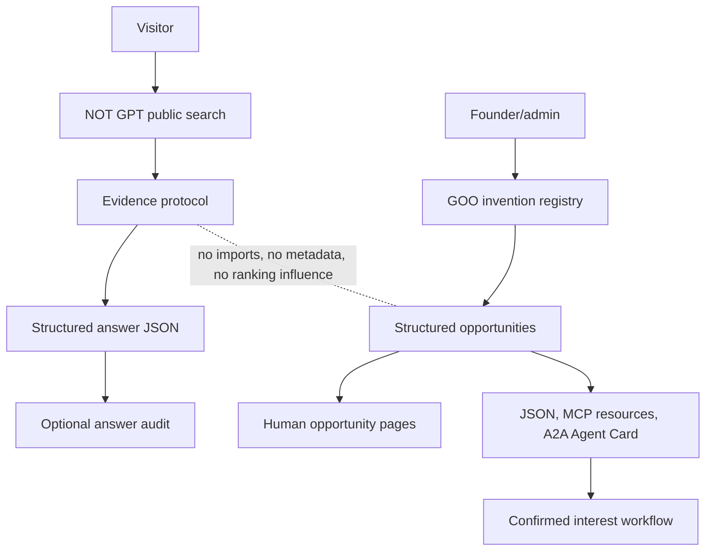

# NOT GPT + GOO

NOT GPT is a clean answer engine that questions its sources before answering. GOO, or Generative Opportunity Optimization, is an independent opportunity-discovery framework for inventions.

> GOO is not part of the NOT GPT answer pipeline. It is an independent opportunity-discovery framework deployed within the same platform.

## Architecture



The code keeps the systems separate:

- `src/services/not-gpt/` contains the answer protocol and does not import GOO services.
- `src/services/goo/` contains project, opportunity, matching and interest logic.
- `src/app/api/not-gpt/*` exposes investigation endpoints.
- `src/app/api/goo/*` exposes opportunity discovery, matching, MCP-style resources/tools and A2A metadata.
- `supabase/migrations/001_initial_schema.sql` defines the database schema and RLS policies.

## NOT GPT

NOT GPT follows a structured protocol:

1. Question interpretation
2. Search-plan generation
3. Diverse retrieval
4. Source extraction
5. Source classification
6. Claim extraction
7. Claim clustering and repetition removal
8. Original evidence tracing
9. Evidence-question matching
10. Contradiction search
11. Uncertainty construction
12. Structured answer generation

The answer contains a direct answer, confident findings, material uncertainties, prioritised source highlights and an optional audit drawer. Demo mode uses fictional illustrative medical-evidence data and clearly states that it is not a live medical investigation.

## GOO

GOO publishes structured opportunities around inventions. Demo projects include Truth Sachet, 31 Seats, Reverse Car Market and Law On Demand. Each opportunity includes requirements, exclusions, geography, commercial terms, IP boundaries, agent permissions, why it exists and what happens after interest is submitted.

GOO trust rules:

- no paid ranking
- no hidden sponsorship
- no fake scarcity
- no agent acceptance of binding terms
- human approval required for role awards and commercial terms

## Routes

- `/` - NOT GPT search
- `/answers/demo` - demo answer share route
- `/methodology` - NOT GPT explainer
- `/goo` - GOO project and opportunity directory
- `/goo/projects/[slug]` - project pages
- `/goo/opportunities/[slug]` - opportunity detail and interest form
- `/admin/goo/projects` - protected project editor
- `/admin/goo/opportunities` - protected opportunity editor
- `/admin/goo/interests` - protected interest review
- `/admin/goo/match-lab` - protected matching laboratory

## REST and Agent Endpoints

- `POST /api/not-gpt/investigate`
- `POST /api/not-gpt/investigate/stream`
- `GET /api/not-gpt/demo`
- `GET /api/goo/projects`
- `GET /api/goo/projects/[slug]`
- `GET /api/goo/opportunities`
- `GET /api/goo/opportunities/[slug]`
- `POST /api/goo/opportunities/[slug]/interest`
- `POST /api/goo/match`
- `GET /api/goo/mcp/resources`
- `GET|POST /api/goo/mcp/tools`
- `GET /api/goo/a2a/agent-card`
- `GET /.well-known/agent-card.json`

## Providers

Provider boundaries exist for:

- web search: `SearchProvider`
- extraction: `ExtractionProvider`
- analysis: `AnalysisProvider`
- embeddings: reserved in database and configuration for project, opportunity and principal embeddings

When provider keys are absent, deterministic demonstration providers are used. Live search support is scaffolded through Brave Search. Extraction uses safe fetch, size limits, sanitisation and prompt-injection detection. Analysis output is validated with Zod before rendering.

## Environment

Copy `.env.example` to `.env.local` and configure as needed.

Important values:

- `SEARCH_PROVIDER=demo|brave`
- `EXTRACTION_PROVIDER=demo|live`
- `ANALYSIS_PROVIDER=demo|openai`
- `BRAVE_API_KEY`
- `OPENAI_API_KEY`
- `NEXT_PUBLIC_SUPABASE_URL`
- `NEXT_PUBLIC_SUPABASE_ANON_KEY`
- `SUPABASE_SERVICE_ROLE_KEY`
- `DEMO_ADMIN_ACCESS=true` for local admin demo
- `ADMIN_API_TOKEN` for protected API/admin integrations
- `ENABLE_GOO_TO_NOTGPT_HOOK=false`

## Supabase

Apply the migration in `supabase/migrations/001_initial_schema.sql`. It creates:

- profiles
- investigations
- sources
- claim_clusters
- projects
- opportunities
- opportunity_interests
- goo_match_runs
- audit_events

RLS allows users to manage their own profiles, investigations and interest records. Public reads are limited to public reports, published projects and published open opportunities. Admin writes require an admin role in Supabase app metadata.

## Security

Retrieved web content is hostile input. The app separates system instructions, user questions, retrieved source text, extracted claims and synthesis inputs. It sanitises rendered content, detects prompt-injection language, rate-limits public actions and never treats webpage text as executable instructions.

## Testing

Run:

```bash
npm install
npm run lint
npm run typecheck
npm test
npm run build
```

Tests cover NOT GPT protocol behavior, architecture separation, GOO matching, agent constraints, sanitisation and migration coverage.

## Deployment

The app is Vercel-compatible. Configure Supabase and provider keys in the deployment environment. Leave `ENABLE_GOO_TO_NOTGPT_HOOK=false` unless deliberately testing a future experimental integration outside the ordinary answer pipeline.

## Known Limitations

NOT GPT cannot guarantee every relevant source was found, every incentive was detected, ownership information is complete, classifications are perfect or the final answer is absolute truth.

GOO cannot guarantee an opportunity owner will respond, a match is commercially suitable, a role will be awarded, terms will be accepted or agent discovery will automatically create demand.
